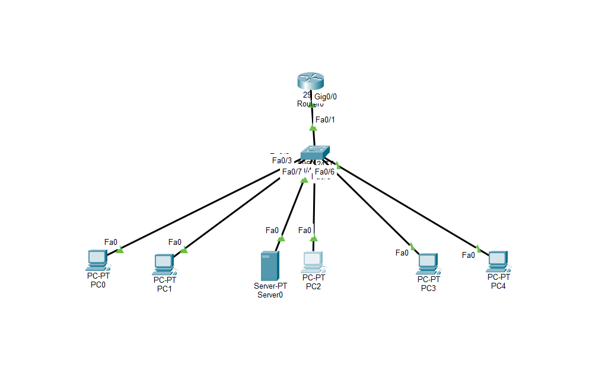

# Lab 2 – VLAN Segmentation & Extended ACL Security

## Objective

The objective of this lab was to build a segmented network using VLANs, configure inter-VLAN routing using router-on-a-stick, and implement an extended Access Control List (ACL) to control traffic between network segments.

The lab demonstrates how ACLs can allow general network connectivity while restricting access to a specific network service.

## Network Topology



The network consists of three VLANs:

| VLAN | Department | Network | Default Gateway |
|------|------------|---------|-----------------|
| 10 | HR | 192.168.10.0/24 | 192.168.10.1 |
| 20 | IT | 192.168.20.0/24 | 192.168.20.1 |
| 30 | Operations | 192.168.30.0/24 | 192.168.30.1 |

An HTTP server (`192.168.20.20`) was placed in VLAN 20 to test service-level traffic filtering.

## Implementation

The network was configured with:

- VLAN segmentation for HR, IT, and Operations
- Access ports assigned to their appropriate VLANs
- An 802.1Q trunk between the switch and router
- Router-on-a-stick for inter-VLAN routing
- Static IP addressing and default gateways
- An HTTP server in the IT VLAN
- An extended ACL for service-level traffic filtering

## Security Policy

The ACL was designed to prevent HR users in VLAN 10 from accessing HTTP services in VLAN 20 while allowing other IP traffic.

 

interface g0/0.10
 ip access-group 100 in
```

The extended ACL was placed inbound on the HR VLAN router subinterface so unwanted traffic could be filtered close to its source.

## Testing & Verification

Testing confirmed that the ACL provided service-specific filtering:

| Test | Result |
|------|--------|
| HR → IT Server ICMP Ping | ✅ Allowed |
| HR → IT Server HTTP (TCP 80) | ❌ Blocked |
| IT → IT Server HTTP (TCP 80) | ✅ Allowed |
| HR → Operations connectivity | ✅ Allowed |

The ACL hit counters were also verified using `show access-lists`, confirming that HTTP traffic from VLAN 10 to VLAN 20 matched the deny rule.

## Troubleshooting

During testing, connectivity to an Operations host initially failed because traffic was sent to `192.168.30.11` instead of the configured host at `192.168.30.10`.

ACL match counters helped confirm that the ACL was permitting the traffic, leading to verification of the destination IP address rather than unnecessary ACL changes.

This demonstrated the importance of validating addressing and using device output to isolate the actual source of a connectivity problem.
https://github.com/JKS767714/Lab-2-VLAN-Segmentation-Inter-VLAN-Routing-Extended-ACL-Security/blob/main/images/Lab2_Sucessful_IT.png
## Key Takeaways

- VLANs create separate logical network segments.
- 802.1Q trunks carry traffic for multiple VLANs.
- Router-on-a-stick enables communication between VLANs.
- Extended ACLs can filter traffic by source, destination, protocol, and port.
- Extended ACLs are generally placed close to the traffic source.
- ICMP and HTTP can be treated differently by an ACL even when communicating with the same destination.
- ACL hit counters are valuable troubleshooting tools.

## Skills Demonstrated

`VLANs` `802.1Q Trunking` `Router-on-a-Stick` `Inter-VLAN Routing` `Extended ACLs` `TCP/IP` `ICMP` `HTTP` `Cisco IOS` `Network Troubleshooting` `Cisco Packet Tracer`
